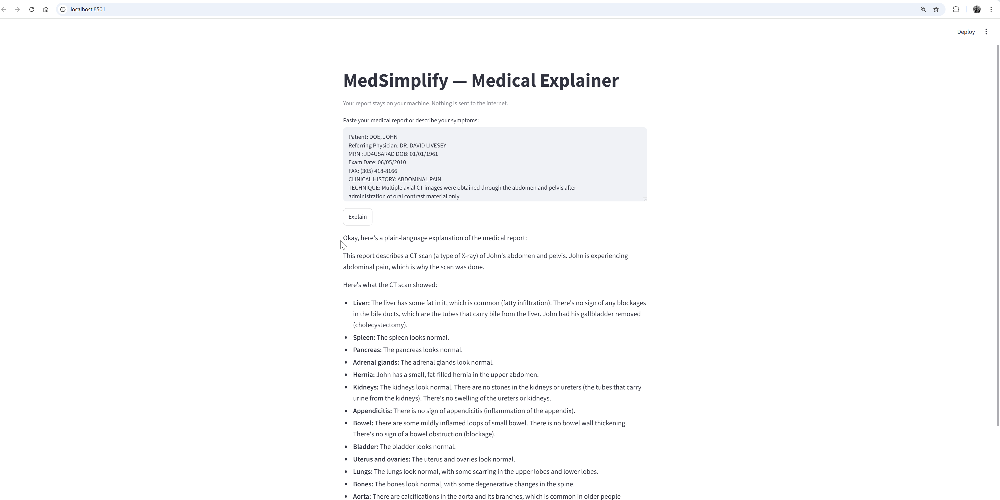

# MedSimplify

A local, offline medical explanation tool. Paste a sanitized medical report or describe symptoms — the app explains them in plain English. Nothing leaves your machine.

> **Not a diagnostic tool.** This tool provides plain-language explanations for educational purposes only. It is not a substitute for professional medical advice. Always consult a qualified healthcare provider.

---

## Project Summary

| Topic | Detail |
|---|---|
| **Goal** | Local WebMD-like app — plain-language report explanation |
| **Active plan** | v2 — open source, local, Ollama + MedGemma 4B + Streamlit |
| **Why v2** | Open-source only, local = no PHI risk, $0 cost, simplest build |
| **Files** | `1_research.md`, `instructions.md`, both summary docs, `src/python/app.py` |
| **Not done yet** | PHI sanitization component — build this separately before using the app |
| **Cost** | $0 ongoing |
| **Standing instructions** | Cite sources, HIPAA warnings, do not assume — from `instructions.md` |

Session notes: memory files live at `C:\LEARNING\MedSimplify\.claude\memory\`. At the start of a new session say "continue MedSimplify" and the next step is testing `app.py` with a sample report.

---

## How It Works

```
Sanitized report (you) --> Streamlit UI --> Ollama (localhost:11434) --> MedGemma 4B --> Plain-language explanation
```

All inference runs locally via Ollama. No API keys. No cloud. No data transmitted externally.

---

## Prerequisites

| Requirement | Notes |
|---|---|
| **Python 3.10+** | `python --version` to check |
| **Ollama** | Install from https://ollama.com — available for Windows, Mac, Linux |
| **~6 GB free RAM** | Required to run MedGemma 4B in CPU mode |
| **~3 GB disk space** | For the MedGemma model weights |

---

## Setup and Run

### 1. Install Ollama

Download and install from https://ollama.com. After installation, Ollama runs as a local server on `localhost:11434`.

Verify it is running:

```bash
ollama list
```

### 2. Pull MedGemma

MedGemma 4B is Google's open-weights model purpose-built for medical text — clinical notes, lab results, radiology reports. One-time download (~2.5–3 GB).

```bash
ollama pull medgemma:latest
```

Verify it loaded:

```bash
ollama run medgemma:latest "What does a high creatinine level mean?"
```

### 3. Install Python Dependencies

```bash
pip install streamlit requests
```

### 4. Run the App

```bash
python -m streamlit run src/python/app.py
```

Opens at http://localhost:8501 in your browser.

---

## GPU Acceleration (Optional)

If you have an NVIDIA GPU, Ollama uses it automatically — no extra configuration needed, just keep drivers up to date. GPU inference is typically 5–10x faster than CPU.
For AMD GPUs on Linux, Ollama supports ROCm.

---

## Alternative: Zero-Code UI via Open WebUI

Prefer a ChatGPT-style browser interface with no Python setup? Use Open WebUI via Docker:

```bash
docker run -d -p 3000:8080 \
  --add-host=host.docker.internal:host-gateway \
  -v open-webui:/app/backend/data \
  --name open-webui ghcr.io/open-webui/open-webui:main
```

Open http://localhost:3000, select `medgemma:latest`, and set a system prompt to explain reports in plain language.

---

## Alternative Models

Swap in a different model by changing the `model` field in `src/python/app.py`:

| Model | Pull Command | RAM | When to Use |
|---|---|---|---|
| `medgemma:latest` | `ollama pull medgemma:latest` | ~6 GB | **Recommended** — medical-specific |
| `llama3.2:3b` | `ollama pull llama3.2:3b` | ~4 GB | Lowest-spec machines, fastest |
| `llama3.2` (8B) | `ollama pull llama3.2` | ~8 GB | Best general balance |
| `gemma3:27b` | `ollama pull gemma3:27b` | ~18 GB | High quality, needs strong hardware |

Do **not** use BioMistral 7B or MedAlpaca 13B — both score below 60% on MedQA benchmarks and are considered unreliable for explanation tasks.

---

## PHI / HIPAA Note

This app does **not** strip PHI. Sanitize all reports before pasting them — remove names, dates of birth, MRN numbers, addresses, and any other identifying information. The sanitization component is a separate step you build yourself.

Since no data leaves your machine, HIPAA transmission risk is minimal for this local architecture. Document your sanitization process if the app is ever shared or audited.

---

## Project Structure

```
MedSimplify/
├── src/python/app.py                      # Streamlit app (main entry point)
├── PROJECT_RECOMMENDATION_SUMMARY_v2.md   # Architecture decisions, model comparison (active plan)
├── PROJECT_RECOMMENDATION_SUMMARY.md      # Cloud/paid path reference (not active)
├── 1_research.md                          # Original research brief
├── instructions.md                        # Standing LLM behavior rules
└── README.md                              # This file
```

---

## Troubleshooting

**Connection refused on port 11434**
Ollama is not running. Open the Ollama desktop app or run `ollama serve` in a terminal.

**Model not found error**
Run `ollama pull medgemma:latest` first, then restart the app.

**Response is very slow**
Running on CPU only — normal behavior. A 4B model on CPU takes 10–30 seconds per response on a typical laptop without a GPU. See the GPU Acceleration section above.

**ModuleNotFoundError: streamlit**
Run `pip install streamlit requests` and try again.


---

## Sample Output — CLI (Ollama Direct)

Run a quick question directly from the terminal to verify MedGemma is working before launching the app:

```
PS C:\LEARNING\MedSimplify> ollama run medgemma:latest "What does a high creatinine level mean?"
```

**MedGemma response:**

```
A high creatinine level in the blood usually indicates that your kidneys aren't
filtering waste products from your blood efficiently. Creatinine is a waste product
created from the normal breakdown of creatine, a compound found in muscle tissue.

Here's a breakdown of what a high creatinine level can mean:

  • Kidney Disease: The most common reason. Conditions such as chronic kidney
    disease (CKD), glomerulonephritis, or polycystic kidney disease impair the
    kidneys' ability to filter waste.

  • Muscle Breakdown: Severe injury, intense exercise, or rhabdomyolysis can
    release large amounts of creatine into the bloodstream.

  • Dehydration: Concentrates creatinine in the blood, causing a falsely elevated
    reading.

  • Medications: Certain antibiotics (aminoglycosides), NSAIDs, and ACE inhibitors
    can affect kidney function and raise creatinine levels.

  • Diet: A high-protein diet can temporarily increase levels but is rarely
    significant without underlying kidney problems.

  • Urinary Tract Obstruction: Blockages such as kidney stones or an enlarged
    prostate can prevent proper filtration.

What to do:
  1. Consult your doctor — they will order follow-up tests such as BUN, urinalysis,
     and eGFR to assess kidney health.
  2. Follow their recommendations — treatment depends on the underlying cause and
     may include lifestyle changes or medication.

Important: Creatinine levels must always be interpreted by a healthcare professional
in the context of your full health picture. Do not self-diagnose or self-treat.
```

---

## Sample Output — Streamlit App

### Starting the app

```bash
python -m streamlit run src/python/app.py
```

Streamlit prints startup output to the terminal:

```
You can now view your Streamlit app in your browser.

  Local URL:   http://localhost:8501
  Network URL: http://10.29.135.65:8501
```

Open the Local URL in your browser. The Network URL lets other devices on your network access the app.

### Using the app

For a real test, paste a sanitized radiology or lab report into the text area. Sample de-identified reports are available at https://usarad.com/ (for testing purposes only — ensure any report you use has all PHI removed before pasting).

### Browser screenshot


